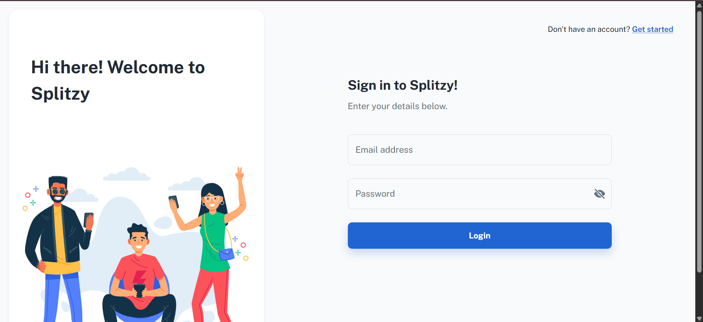
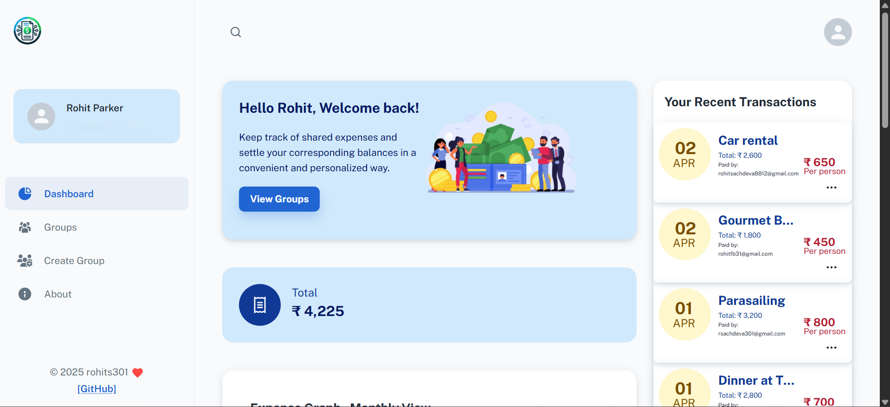
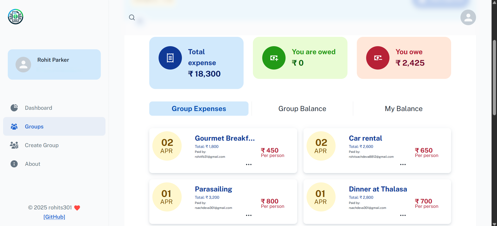
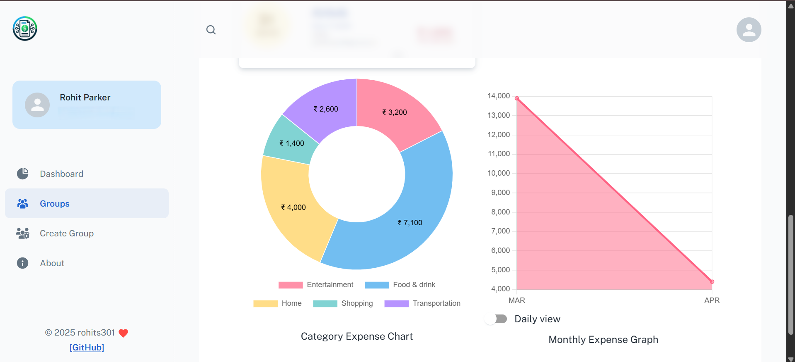

# Splitzy


>  A Full-Stack Group Expense Splitting Application


##  Introduction

Splitzy is a full-stack expense splitting application inspired by [Splitwise](https://splitwise.com). It allows groups of friends to split expenses fairly, track balances, and visualize their spending patterns. Built with:

- React.js, Node.js, Express.js
- PostgreSQL
- Chart.js for analytics

### Screens

Login 
Dashboard 
Group Management 
Analytics 

Use cases:
- Roommates splitting rent and groceries
- Friends tracking shared travel expenses
- Teams organizing event budgets

## Key Features

-  Create and manage user groups
-  Log shared expenses and split them automatically
-  View group balances
-  Monthly and category-wise spending analytics
-  JWT-based user authentication
-  Multiple user registration & login support


## Tech Stack

###  Frontend

- [React.js](https://reactjs.org/)
- [Redux](https://redux.js.org/) – for global state management
- [Axios](https://axios-http.com/) – for HTTP requests
- [Material UI](https://mui.com/) – modern UI components
- [Chart.js](https://www.chartjs.org/) & [react-chartjs-2](https://react-chartjs-2.js.org/) – data visualizations

###  Backend

- [Node.js](https://nodejs.org/) + [Express.js](https://expressjs.com/)
- [PostgreSQL](https://www.postgresql.org/) – for database management
- [bcrypt.js](https://github.com/dcodeIO/bcrypt.js/) – password encryption
- [JWT](https://github.com/auth0/node-jsonwebtoken) – secure authentication


## Local Setup

### Prerequisites

- Node.js + pnpm
- PostgreSQL
- Git

### Clone and Setup

```bash
git clone <repository-url>
cd Splitzy
```

### Setup Frontend

```bash
cd client
pnpm install      # Install frontend dependencies
pnpm start        # Launch frontend on http://localhost:3000
```

### Setup Backend

1. In the root directory, create a `.env` file:

```env
PORT=3001
PostgreSQL_URI=your_database_uri_here
ACCESS_TOKEN_SECRET=your_random_secret_key_here
```

Provide some random key in ACCESS_TOKEN_SECRET or you could generate one using node. Enter the below command in the terminal to genrate a strong secret key:

```bash
node -e "console.log(require('crypto').randomBytes(256).toString('base64'));"
```

2. Then, in the root directory:

```bash
pnpm install      # Install backend dependencies
pnpm start        # Launch backend server on http://localhost:3001
```

## Folder Structure

```
Splitzy/
├── client/           # React frontend
├── server/           # Express backend
├── .env.example      # Environment variable template
├── README.md
```

## License

This project is licensed under the [MIT License](LICENSE.md).
